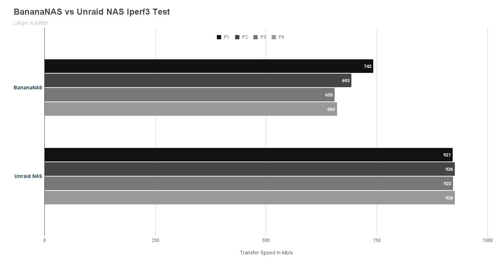
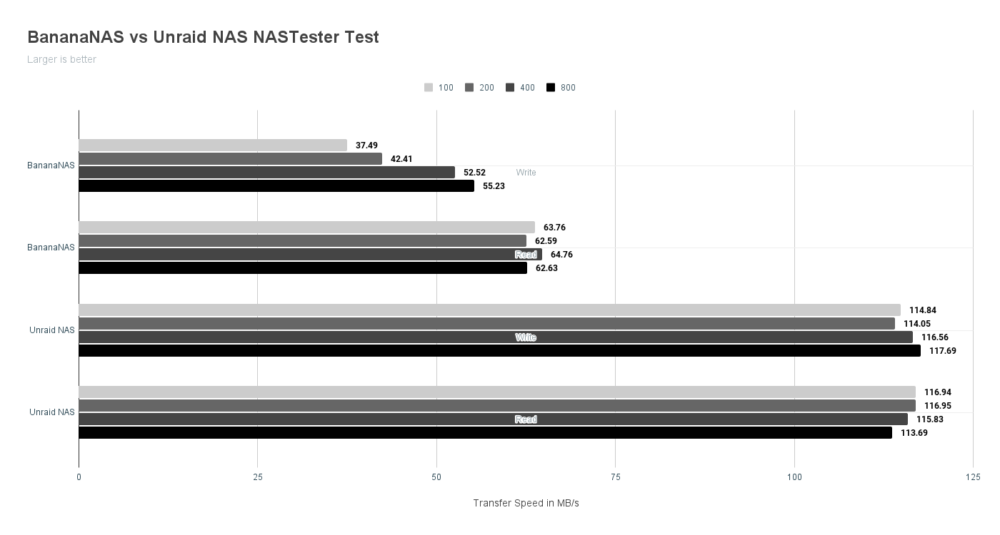

Kali ini saya akan membagikan pengalaman saya saat saya migrasi perangkat NAS dari PC build up yang terpasang Unraid, ke *single board computer* (SBC) Banana Pi M1. Motivasi migrasi kali ini adalah karena saya sudah tidak membutuhkan banyak space penyimpanan lagi, dan untuk menghemat pemakaian daya listrik home server saya. Tulisan saya ini masih terkait dengan [penghematan daya listrik]() yang pernah saya tulis sebelumnya.

## Latar Belakang

Meskipun sudah beberapa kali saya berganti perangkat NAS, namun sistem operasi yang saya gunakan selalu Unraid. OS ini memiliki kelebihan utama yaitu dapat menggabungkan berbagai kapasitas hard disk yang berbeda menjadi satu *array* yang sama. Masing-masing hard disk memiliki partisi XFS yang dapat dibaca di perangkat Linux pada umumnya, karena Unraid menuliskan berkas lengkap di satu harddisk tertentu, bukannya memisahkannya *bit by bit* seperti yang dilakukan oleh RAID tradisional.

Konfigurasi seperti ini menarik bagi saya, karena saya bisa membeli hard disk dengan ukuran 2 TB misalnya, dengan harga yang cukup terjangkau, lalu ketika saya membutuhkan space tambahan saya bisa dengan mudah menambahkan hard disk yang ukurannya tidak harus sama. *Storage* ini kemudian saya gunakan mayoritas untuk menyimpan media (movies dan series).

Namun kebutuhan *storage* saya berubah ketika saya menemukan Stremio, platform streaming yang tidak membutuhkan perangkat penyimpanan lokal. Sekarang kebutuhan saya hanya untuk *back up* berkas-berkas penting saja, yang mana tidak membutuhkan *space* yang terlalu banyak. Alangkah mubazir apabila saya harus menggunakan PC build up HP 8300 SFF, yang harus selalu berjalan 24/7 sebagai perangkat NAS.

## Mengapa Banana Pi?

Perangkat ini sudah saya miliki sejak tahun 2016 silam. Banana Pi memiliki keunggulan yang tidak dimiliki oleh Raspberry Pi, antara lain karena adanya port SATA, sehingga harddisk internal bisa digunakan secara langsung tanpa harus menggunakan port USB. Selain itu *board* ini juga sudah memiliki port ethernet gigabit yang saling melengkapi port SATA pada saat transfer data ke perangkat lain.

NAS menggunakan Banana Pi ini selanjutnya akan saya sebut dengan BananaNAS.

Berikut ini spesifikasi keduanya.

| **Komponen** | **BananaNAS**                      | **Unraid NAS**                                     |
|----------|--------------------------------|------------------------------------------------|
| CPU      | Dual-Core Cortex-A7 ARM @ 1GHz | Quad-Core Intel Core i5-3470 @ 3.5GHz          |
| RAM      | 1GB DDR3                       | 16GB DDR3                                      |
| Storage  | 1 x 2TB 2.5" HDD @ 5400 RPM    | 2 x 128GB 2.5" SSD & 2 x 2TB 3.5" HDD @ 5400 RPM |


## Hasil Pengujian

Untuk menguji sebuah NAS, saya ingin tahu seberapa cepat kecepatan transfer melalui ethernet yang diuji menggunakan `iperf3`. Sedangkan kecepatan read / write pada harddisk melalui jaringan ethernet akan diuji menggunakan NASTester.


### iperf3

Pengujian yang pertama saya lakukan adalah tes bandwidth menggunakan `iperf3`. Tool ini terkenal CPU bounded, artinya hasil dipengaruhi oleh seberapa kuat CPU yang digunakan. Tes ini bisa memberikan gambaran perbedaan antara NAS Unraid dengan BananaNAS yang notabene memiliki CPU yang lebih lemah dibanding Unraid NAS saya.

Perintah yang saya gunakan adalah sebagai berikut, dengan flag parallel (-P) saya ganti mulai dari 1 sampai dengan 4.
```
iperf3 -c 10.20.30.50 -t 60 -P 1
```


Hasilnya sudah dapat ditebak, bahwa di pengujian iperf3 BananaNAS 26% lebih lambat ketimbang Unraid dengan spek yang jauh lebih tinggi. Dengan rata-rata transfer speed sebesar 687.5 Mb/s atau sekitar 86 MB/s, masih ada di dalam range kecepatan harddisk 2.5 inch di kecepatan 5400 RPM, yaitu mulai dari 80 hingga 100 MB/s saja.

### NASTester

Kali ini saya akan membandingkan performa baca dan tulis dari PC utama saya ke masing-masing NAS. Koneksi antara PC dan NAS menggunakan kabel UTP CAT 6 untuk memastikan koneksi gigabit dapat dicapai dengan stabil.

Pengujian ini dilakukan 7 kali di masing-masing NAS. Tiap pengujian termasuk baca dan tulis, menggunakan ukuran file yang berbeda-beda, mulai dari 100MB sampai dengan 800MB. Tujuannya adalah mengetahui hubungan antara kapasitas RAM dengan kecepatan transfer, karena saya menduga RAM yang besar memungkinkan berkas di-*cache* sebelum dituliskan ke harddisk.



Hasilnya, kecepatan transfer BananaNAS 50% lebih lambat ketimbang Unraid NAS untuk operasi baca dan tulis. Kecepatan tulis BananaNAS untuk berkas yang berukuran kecil terlihat lebih lambat dibandingkan berkas dengan ukuran yang lebih besar. Sementara Unraid NAS terlihat lebih stabil di semua ukuran berkas yang ditransfer.

## Konsumsi Daya

Sejak menggunakan BananaNAS, konsumsi daya listrik untuk perangkat NAS turun dari yang awalnya 36 watt menjadi 4 watt saja! Dengan asumsi perangkat NAS menyala 24/7, maka ongkos listrik bulanan untuk NAS bisa dihemat hingga Rp50.000.


## Kesimpulan

Migrasi dari Unraid NAS ke BananaNAS terdengar seperti sebuah *downgrade*. Namun mengingat kebutuhan saya sudah berubah – yang awalnya untuk penyimpanan media dengan ukuran yang besar ke perangkat *backup* saja – maka BananaNAS saya rasa sudah sangat cukup.

Penghematan listrik bulanan menjadi sangat menarik, sebab BananaNAS saya buat menggunakan perangkat yang sudah saya miliki sebelumnya, sehingga tidak perlu repot-repot memikirkan ROI.

Stay curious! ✨
