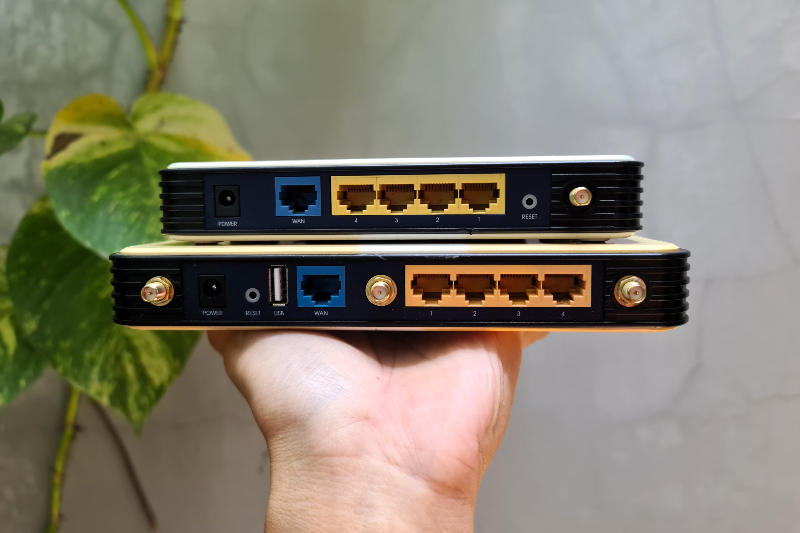
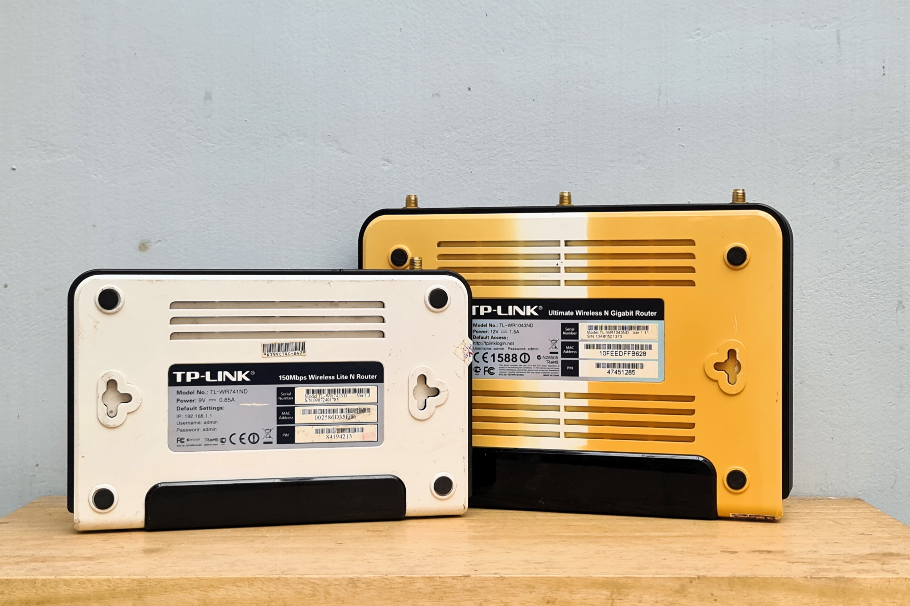

*Managed switch* adalah perangkat jaringan yang masih kurang lazim ditemui di topologi jaringan rumahan. Meski begitu, sebenarnya jenis switch ini menyimpan segudang fitur yang tidak dimiliki oleh *unmanaged switch*, salah satunya adalah pengaturan VLAN. Fitur ini menjadi sangat penting apabila kita ingin menghemat kabel UTP / jumlah port. Dengan VLAN, satu kabel / port bisa membawa jaringan dengan banyak *subnet* sekaligus.

Akhir-akhir ini, saya migrasikan *router* ke Mikrotik RouterOS yang saya *install* di mini PC dengan bantuan Proxmox. Mini PC yang saya gunakan menggunakan *motherboard* biasa, sehingga hanya memiliki 1 port LAN saja. Sedangkan pada umumnya, sebuah router memerlukan 2 port sekaligus, satu untuk WAN dan yang lainnya untuk LAN. VLAN bisa menjadi solusinya.

Sayangnya *managed switch* yang paling murah di pasaran masih di kisaran harga Rp300.000-an, harga yang bagi saya masih terlalu tinggi untuk perangkat *switch* rumahan. Karena saya hobi membeli perangkat jaringan *secondhand*, maka terbesit di pikiran saya untuk 'menikahkan' *router* bekas dengan OpenWRT untuk disulap menjadi *switch*.

Perangkat yang saya beli adalah TP-Link TL-WR1043ND dan TL-WR741ND. Kedua perangkat tersebut saya dapatkan dengan harga masing-masing Rp65.000 dan Rp45.000. Perangkat pertama memiliki port gigabit, sehingga cocok digunakan untuk VLAN jaringan lokal atau LAN, sedangkan perangkat yang lain hanya *mentok* di 10/100 saja, sehingga lebih cocok digunakan untuk VLAN WAN, yang mana biasanya kecepatan internet dari ISP tidak lebih dari 100Mbps.

Saya tidak akan menuliskan tata cara instalasi OpenWRT karena sudah banyak di internet sana. Sedangkan untuk pengaturan VLAN, mungkin akan saya bahas di tulisan berikutnya. Namun hal terpenting yang perlu diingat ketika menggunakan OpenWRT di perangkat *router* lawas adalah kapasitas RAM dan flash storage. Perangkat dengan 4MB RAM dan 32MB flash sudah tidak didukung versi terbaru OpenWRT, sehingga solusinya bisa menggukana rilis yang lebih lawas, seperti 18.04 atau 19.07. Meski versi lawas, namun tidak mengurangi fungsionalitas sama sekali.

Saya selalu merekomendasikan untuk selalu riset riset dan riset terlebih dahulu sebelum membeli. Karena setiap model *router* bisa jadi berperilaku berbeda-beda meski dibuat oleh pabrikan yang sama. Contohnya, poer WAN di TP-Link TL-WR1043ND bisa digunakan untuk pengaturan VLAN (sehingga total port yang dapat dipakai ada 5), sedangkan di TP-Link TL-WR741ND port WAN tidak bisa.

Sekian tulisan singkat ini saya buat, semoga bisa memberi inspirasi bagi teman-teman untuk bisa menggunakan perangkat elektronik yang masih layak dipakai. Karena apabila tidak, perangkat-perangkat tersebut akan menjadi *electronic waste* yang bisa merusak lingkungan.

Stay curious! ✨